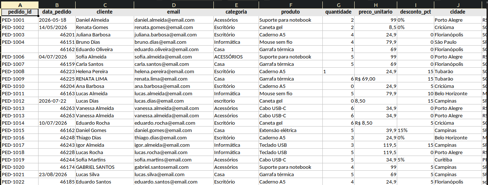
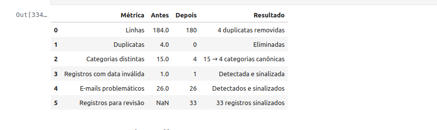
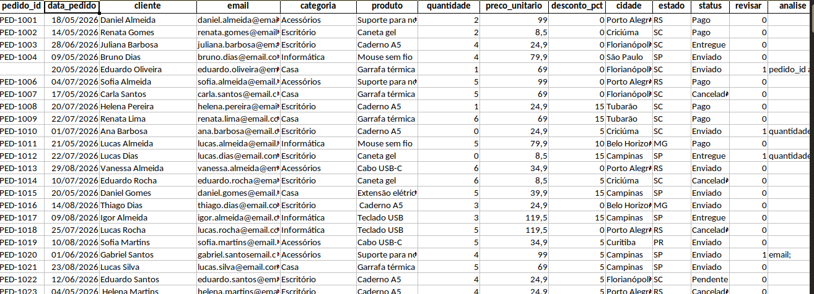

# Data Cleaning Portfolio

Case demonstrativo de limpeza, padronização e validação de uma base de pedidos em Excel usando Python e Pandas.

O objetivo é transformar uma base deliberadamente inconsistente em um conjunto de dados estruturado e utilizável, preservando valores ambíguos para revisão em vez de inventar correções.

## Problema

A base original continha, entre outros problemas:

- linhas duplicadas;
- categorias escritas de formas diferentes;
- datas em formatos mistos;
- valores monetários com diferentes representações;
- campos ausentes;
- quantidades inválidas;
- e-mails ausentes ou malformados;
- estados inválidos;
- identificadores ausentes.



## Processo

O tratamento inclui:

1. remoção de duplicatas;
2. normalização de textos e categorias;
3. conversão e validação de datas;
4. padronização de preços e descontos;
5. validação de e-mails, estados, quantidades e IDs;
6. criação de flags de revisão para valores que não podem ser corrigidos com segurança;
7. geração de campos derivados;
8. exportação para Excel em formato reutilizável.

Valores ambíguos não são inferidos automaticamente: são preservados e sinalizados para revisão.

## Resultado



A base passou de **184 para 180 linhas**, com:

- 4 duplicatas removidas;
- 15 variações de categoria reduzidas a 4 categorias canônicas;
- 0 duplicatas restantes;
- 34 registros identificados para revisão;
- inconsistências de data, e-mail, estado, quantidade, preço e desconto explicitamente sinalizadas.


## Saída

O resultado final é uma planilha limpa e estruturada, adequada para análise, importação ou processamento posterior.



## Ferramentas

- Python
- Pandas
- Jupyter Notebook
- Excel / XLSXWriter

## Estrutura do projeto

```text
data-cleaning-portfolio/
├── README.md
├── data/
│   ├── raw/
│   └── processed/
├── notebooks/
│   └── 01_data_cleaning.ipynb
└── assets/